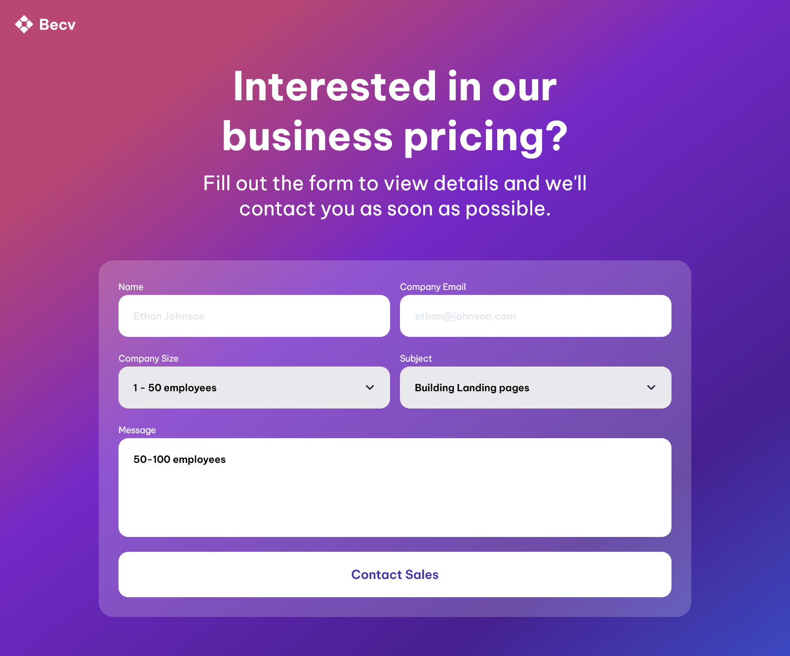

# Simple Homepage

This is a small project I made to train with HTML, CSS and Flexbox.

## Table of Content

- [Overview](#overview)
  - [Description](#description)
  - [Screenshot](#screenshot)
  - [Links](#links)
- [My process](#my-process)
  - [Built with](#built-with)
  - [What I learned](#what-i-learned)
  - [Continued Development](#continued-development)
  - [Useful Resources](#useful-resources)
- [Author](#author)
- [Acknowledgments](#acknowledgments)

## Overview

### Description

I present to you a small project I made. The main objective was to work with HTML, CSS and Flexbox to perfect my knowledge with those technologies.
It consist of a simple contact page containing a form with multiple type of input.
This project works on all device, from smartphone to desktop computer !

### Screenshot



### Links

- [Live Site](https://sephydev.github.io/contact-page/)

## My process

### Built with

- Semantic HTML5
- CSS
- Flexbox

### What I learned

Thanks to this project, I've practiced some semantic HTML, CSS and Flexbox. The following snippets are some examples of the knowledges I used.

- Semantic HTML5 (`<select>`):

```html
<select id="size" name="size">
  <option value="50-100">1 - 50 employees</option>
  <option value="100-200">50 - 100 employees</option>
  <option value="200+">100+ employees</option>
</select>
```

- CSS (`select`):

```css
select {
  appearance: none;
  background-image: url("./assets/Expand_down.svg");
  background-repeat: no-repeat;
  background-position: 95%;
}
```

- Flexbox (`.last`):

```css
.flex {
  display: flex;
  gap: 1rem;
}
```

### Continued Development

Seeing how Flexbox simplify webpage organization, I will continue to master these technologie.
I will do that by using those on other project, notably to make responsive website.

### Useful Resources

- [Guide to Flexbox (CSS Trick)](https://css-tricks.com/snippets/css/a-guide-to-flexbox/)

## Author

- Website : Sephydev

## Acknowledgment

Thanks to my friends and my family for supporting me while I journey in the land of Web Development, and during the making of this project !
